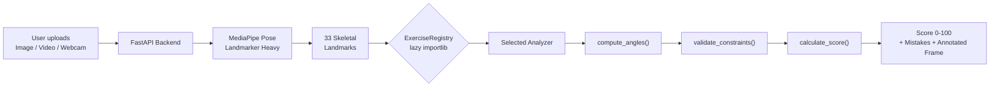

<div align="center">

# FormCore.AI

**Real-time AI-powered exercise form analysis using computer vision.**

Analyze **14 exercises** — squats, pushups, deadlifts, lunges, planks, and more — with instant biomechanical feedback. Upload a video, an image, or use your webcam.

[](https://nextjs.org/)
[](https://react.dev/)
[](https://fastapi.tiangolo.com/)
[](https://mediapipe.dev/)
[](https://tailwindcss.com/)
[](LICENSE)

</div>

---

## ✨ Features

| Feature | Description |
|---|---|
| **14 Supported Exercises** | Modular analyzer system covering lower body, upper body, and static holds. |
| **3 Input Modes** | Upload an **image**, a **video**, or use your **live webcam**. |
| **33-Point Skeletal Tracking** | Powered by Google's **MediaPipe Pose Landmarker (Heavy)** model. |
| **Annotated Output** | Skeleton-overlaid images/videos with angle measurements on keypoints. |
| **Instant Feedback** | Scored results (0–100) with actionable mistake callouts. |
| **Static Exercise Support** | Plank and holds scored on alignment consistency, not rep counting. |
| **Dynamic Exercise List** | Frontend auto-syncs available exercises from the backend. |
| **Privacy First** | All processing happens on your local machine. |

---

## 🏋️ Supported Exercises

### Lower Body
| Exercise | Key Checks |
|---|---|
| **Squat** | Knee depth (Hip-Knee-Ankle), forward lean |
| **Lunge** | Knee-over-toe tracking, torso uprightness |
| **Romanian Deadlift** | Minimal knee bend, hip hinge depth |
| **Glute Bridge** | Full hip extension |
| **Calf Raise** | Knee stability, ankle range |
| **Bulgarian Split Squat** | Front knee depth, torso lean |

### Upper Body
| Exercise | Key Checks |
|---|---|
| **Pushup** | Elbow depth, body alignment (sag/pike) |
| **Deadlift** | Back inclination, lockout, start position |
| **Overhead Press** | Back arch, elbow lockout |
| **Shoulder Press** | Elbow flare, shoulder abduction |
| **Bicep Curl** | Elbow drift (cheating), full ROM |
| **Tricep Dip** | Elbow depth |
| **Mountain Climber** | Body alignment, knee drive |

### Static Holds
| Exercise | Key Checks |
|---|---|
| **Plank** | Shoulder-Hip-Ankle alignment, hip sag/pike |

---

## 🏗️ Architecture

```
formcore-ai/
├── src/                          # Frontend (Next.js 16)
│   ├── app/
│   │   ├── layout.tsx            # Root layout, custom fonts, SmoothScroll
│   │   ├── page.tsx              # Home — Hero, Features, Analyzer, Footer
│   │   └── globals.css           # Neural Lab dark theme & design tokens
│   ├── components/
│   │   ├── analyzer/
│   │   │   ├── AnalyzerContainer.tsx   # Main orchestrator
│   │   │   ├── ExerciseSelector.tsx    # Auto-synced dropdown (fetches from /exercises)
│   │   │   ├── ModeSelector.tsx        # Image / Video / Live Cam toggle
│   │   │   ├── DropZone.tsx            # Drag-and-drop file upload
│   │   │   ├── ResultsView.tsx         # Score, mistakes, annotated media
│   │   │   └── WebcamStage.tsx         # Live webcam feed
│   │   ├── layout/                # Navbar, Hero, Footer
│   │   ├── sections/              # Feature cards
│   │   └── ui/                    # Design system (BentoCard, GlowingEffect, etc.)
│   ├── store/
│   │   └── useAnalyzerStore.ts    # Zustand — mode, exercise, exercises[], results
│   └── lib/
│       ├── api.ts                 # API_BASE_URL config
│       └── utils.ts               # cn() helper
│
├── backend/                       # Backend (FastAPI + Python)
│   ├── main.py                    # API: /exercises, /analyze/image, /analyze/video
│   └── app/
│       ├── pose_engine.py         # MediaPipe detection, frame annotation, video processing
│       ├── geometry.py            # Shared math: calculate_angle, detect_visible_side, etc.
│       ├── schemas.py             # Pydantic: AnalysisResult
│       └── analyzers/             # Modular exercise system (14 analyzers)
│           ├── base.py            # BaseAnalyzer — Template Method pattern
│           ├── registry.py        # Lazy importlib registry + list_exercises()
│           ├── squat.py           # SquatAnalyzer
│           ├── pushup.py          # PushupAnalyzer
│           ├── deadlift.py        # DeadliftAnalyzer
│           ├── lunge.py           # LungeAnalyzer
│           ├── romanian_deadlift.py
│           ├── glute_bridge.py
│           ├── calf_raise.py
│           ├── bulgarian_split_squat.py
│           ├── overhead_press.py
│           ├── shoulder_press.py
│           ├── bicep_curl.py
│           ├── tricep_dip.py
│           ├── plank.py           # PlankAnalyzer (static mode)
│           └── mountain_climber.py
│
└── run_dev.bat                    # One-click startup (Windows)
```

---

## 🧠 How It Works



### Analyzer Interface (Template Method)

Every analyzer implements three methods — the base class orchestrates them:

```python
class BaseAnalyzer(ABC):
    def analyze(self, landmarks, w, h):
        angles = self.compute_angles(landmarks, w, h)
        penalty, mistakes = self.validate_constraints(angles)
        score = self.calculate_score(penalty)
        return score, mistakes, feedback_color, metadata

    @abstractmethod
    def compute_angles(self, landmarks, w, h) -> dict: ...
    @abstractmethod
    def validate_constraints(self, angles) -> tuple[int, list[str]]: ...
    @abstractmethod
    def draw_annotations(self, image, metadata) -> None: ...
```

---

## 🚀 Quick Start

### Prerequisites

- **Python 3.10+**
- **Node.js 18+**

### 1. Clone

```bash
git clone https://github.com/<your-username>/formcore-ai.git
cd formcore-ai
```

### 2. One-command start (Windows)

```bat
run_dev.bat
```

### 3. Manual start

**Backend** (`http://localhost:8000`):
```bash
cd backend
pip install -r requirements.txt
python -m uvicorn main:app --reload
```

**Frontend** (`http://localhost:3000`):
```bash
cd src
npm install
npm run dev
```

---

## 🔌 API Reference

### `GET /exercises`

Returns all supported exercise types.

```json
{
  "exercises": [
    "bicep_curl", "bulgarian_split_squat", "calf_raise", "deadlift",
    "glute_bridge", "lunge", "mountain_climber", "overhead_press",
    "plank", "pushup", "romanian_deadlift", "shoulder_press",
    "squat", "tricep_dip"
  ]
}
```

### `POST /analyze/image`

| Parameter | Type | Default | Description |
|---|---|---|---|
| `file` | `UploadFile` | *required* | Image file (JPEG, PNG) |
| `exercise` | `string` | `"squat"` | Any exercise from `/exercises` |

### `POST /analyze/video`

| Parameter | Type | Default | Description |
|---|---|---|---|
| `file` | `UploadFile` | *required* | Video file (MP4, MOV) |
| `exercise` | `string` | `"squat"` | Any exercise from `/exercises` |

**Response schema** (both endpoints):
```json
{
  "score": 85,
  "mistakes": ["Torso leaning (35°). Stay upright."],
  "image_base64": "<annotated frame>",
  "video_base64": "<tracked video, video endpoint only>"
}
```

---

## 🧩 Adding a New Exercise

1. **Create** `backend/app/analyzers/your_exercise.py`:
   ```python
   from app.analyzers.base import BaseAnalyzer
   from app.geometry import calculate_angle, detect_visible_side, to_pixel, landmark_to_point

   class YourExerciseAnalyzer(BaseAnalyzer):
       def compute_angles(self, landmarks, w, h): ...
       def validate_constraints(self, angles): ...
       def draw_annotations(self, image, meta): ...
   ```

2. **Register** in `backend/app/analyzers/registry.py`:
   ```python
   "your_exercise": ("app.analyzers.your_exercise", "YourExerciseAnalyzer"),
   ```

3. That's it — the frontend auto-syncs from `/exercises`.

---

## 🎨 Design System

| Token | Value | Usage |
|---|---|---|
| `--background` | `#050507` | Page background |
| `--neon-primary` | `#7C3AED` | Primary accent (violet) |
| `--neon-secondary` | `#A78BFA` | Secondary accent |
| `--surface` | `#0F0F16` | Card backgrounds |

**Typography:** Ndot 55, NType82 Headline, NType82 Regular, LetteraMono.
**Effects:** Glassmorphism, cursor-reactive glow, Lenis smooth scroll, Framer Motion animations.

---

## 🛠️ Tech Stack

| Layer | Technology |
|---|---|
| **Framework** | Next.js 16 (App Router) |
| **UI** | React 19, Tailwind CSS v4, Framer Motion |
| **State** | Zustand |
| **Backend** | FastAPI, Uvicorn |
| **CV Engine** | MediaPipe Pose Landmarker (Heavy) |
| **Image Processing** | OpenCV, NumPy |
| **Video Encoding** | imageio-ffmpeg (H.264) |

---

## 📄 License

This project is licensed under the MIT License — see the [LICENSE](LICENSE) file for details.

---

<div align="center">

**Built with 🧠 by FormCore AI**

</div>
